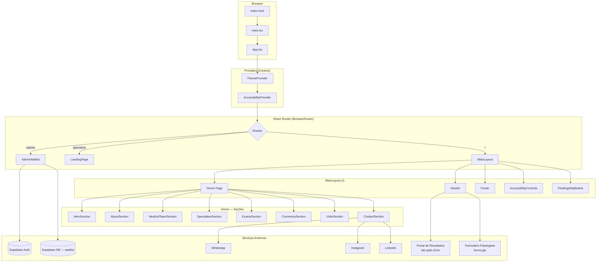
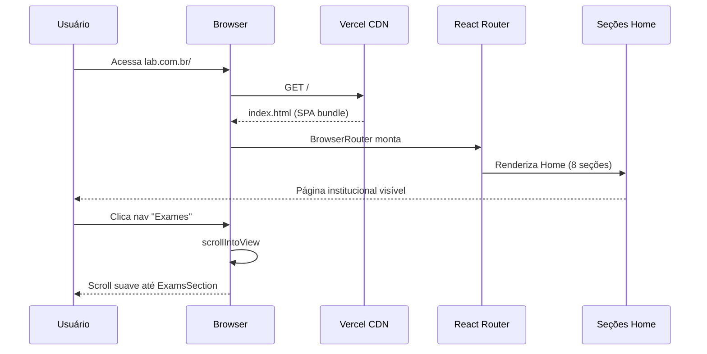
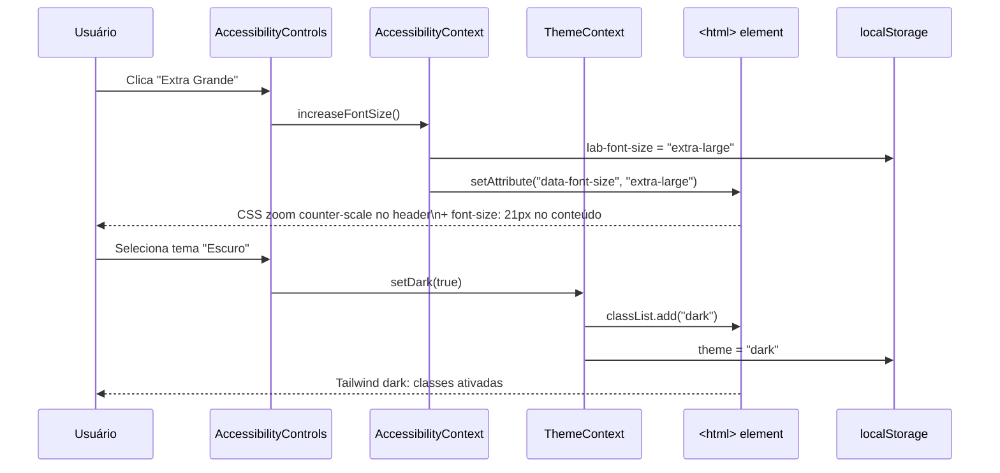
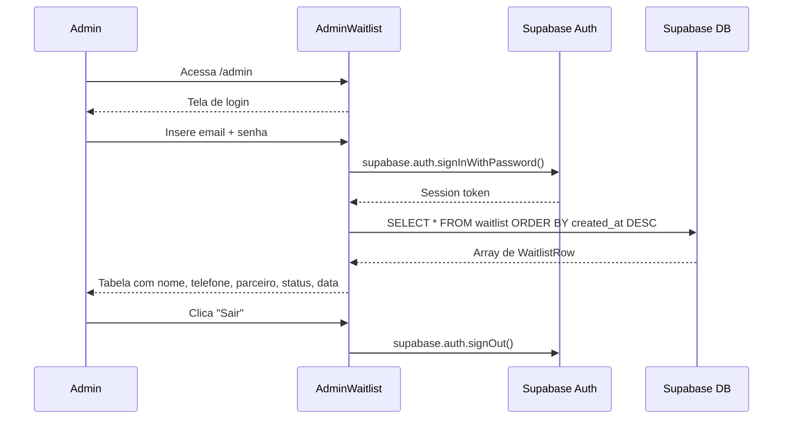

# Architecture — LAB Laboratório e Medicina Diagnóstica

> Última atualização: 13 de maio de 2026

---

## Visão Geral

O **LAB** é o site institucional digital do Laboratório e Medicina Diagnóstica LAB, com mais de 50 anos de atuação em Brasília-DF. A aplicação serve como vitrine institucional, canal de contato, portal de agendamento e espaço para parceiros comerciais.

O sistema é uma **SPA (Single Page Application)** construída em React + TypeScript, com três rotas principais: a landing page institucional (`/`), uma landing page voltada a parceiros (`/parceiros`) e um painel administrativo protegido por autenticação Supabase (`/admin`). O deploy é feito via Vercel com rewrite para suportar navegação client-side.

O projeto aplica um **Design System próprio (FlowLAB)** com tokens de cor azul/índigo, modo escuro nativo, e dois widgets flutuantes de acessibilidade: controles de tamanho de fonte + alto contraste (canto inferior esquerdo) e central de ajuda em modal (canto inferior direito).

---

## Stack Tecnológica

| Categoria            | Tecnologia                   | Versão      | Observação                                      |
|----------------------|------------------------------|-------------|-------------------------------------------------|
| Linguagem            | TypeScript                   | 5.7.2       | Strict mode, `noEmit`, `moduleResolution: bundler` |
| UI Framework         | React                        | 18.3.1      | StrictMode, functional components, hooks        |
| Roteamento           | React Router DOM             | 7.15.0      | BrowserRouter, outlet layout pattern            |
| Animações            | Framer Motion                | 11.11.17    | AnimatePresence, motion, useScroll/useTransform |
| Ícones               | lucide-react                 | 0.468.0     | Tree-shakeable, SVG                             |
| Estilização          | Tailwind CSS                 | 3.4.16      | JIT, `darkMode: 'class'`, fonte Inter           |
| Build / Dev Server   | Vite                         | 6.0.3       | `@vitejs/plugin-react`, ESM nativo              |
| Backend / Auth / DB  | Supabase JS                  | ^2.105.4    | Auth e tabela `waitlist`                        |
| Deploy               | Vercel                       | —           | SPA rewrite, env vars configuradas no dashboard |
| CSS pós-processador  | PostCSS + Autoprefixer       | 8.4.49      | Integrado ao Vite                               |
| Tipagem de ambiente  | vite/client                  | —           | Resolve `import.meta.env`                       |

---

## Estrutura de Diretórios

```
landing page saude preventiva/
├── index.html                    # Entry HTML — mounts #root, favicons, Inter font
├── vite.config.ts                # Configuração Vite (plugin-react)
├── tsconfig.json                 # TypeScript strict, target ES2020, include: src/
├── tailwind.config.js            # darkMode: class, content: index.html + src/**
├── postcss.config.js             # Autoprefixer
├── vercel.json                   # Build config + SPA rewrite rule
├── package.json                  # Scripts: dev / build (tsc && vite build) / preview
├── .env                          # Variáveis Supabase (gitignored)
├── .gitignore
│
├── src/
│   ├── main.tsx                  # Ponto de entrada React (createRoot)
│   ├── App.tsx                   # Roteamento raiz + providers + MainLayout
│   ├── index.css                 # Tailwind base/components/utilities + vars CSS acessibilidade
│   ├── supabaseClient.ts         # Instância singleton do supabase + tipo WaitlistRow
│   ├── AdminWaitlist.tsx         # Painel admin (autenticação Supabase, tabela waitlist)
│   ├── LandingPage.tsx           # Landing page de parceiros (SPA independente)
│   │
│   ├── context/
│   │   └── ThemeContext.tsx      # Tema dark/light: estado, localStorage, toggle, setDark
│   │
│   ├── components/
│   │   ├── Header.tsx            # Header sticky glassmorphism + nav scroll-spy + mobile drawer
│   │   ├── Footer.tsx            # Rodapé institucional mínimo
│   │   ├── AccessibilityContext.tsx  # Contexto: fontSize (4 níveis) + highContrast
│   │   ├── AccessibilityControls.tsx # Widget flutuante bottom-left (tema/fonte/contraste)
│   │   ├── FloatingHelpButton.tsx    # Widget flutuante bottom-right (modal HelpCenter)
│   │   ├── HelpCenter.tsx            # Conteúdo do modal: busca + categorias + FAQ accordion
│   │   └── helpData.ts               # Dados estáticos: 5 categorias e 15 FAQs do LAB
│   │
│   ├── hooks/
│   │   └── useHideNearFooter.ts  # IntersectionObserver no <footer> → oculta botões flutuantes
│   │
│   └── pages/
│       ├── Home/
│       │   ├── index.tsx             # Compositor da Home (ordena as seções)
│       │   ├── HeroSection.tsx       # Slider de imagens com autoplay (Framer Motion)
│       │   ├── AboutSection.tsx      # Sobre + vídeo + MVV (missão/visão/valores) + accordion
│       │   ├── MedicalTeamSection.tsx# Corpo clínico
│       │   ├── SpecialtiesSection.tsx# Cards de especialidades
│       │   ├── ExamsSection.tsx      # Catálogo de exames
│       │   ├── ConveniosSection.tsx  # Logo grid de convênios (46 planos)
│       │   ├── UnitsSection.tsx      # Unidades com mapa / endereço
│       │   ├── ContactSection.tsx    # Contato: WhatsApp, Instagram, LinkedIn, e-mail
│       │   └── FAQSection.tsx        # ⚠️ Arquivo legado — removido da Home, ainda existe
│       └── Parceiros/
│           └── index.tsx             # Re-export de LandingPage para a rota /parceiros
│
└── public/
    └── assets/
        ├── favicon/              # favicon.ico, 16/32px png, apple-touch-icon, android-chrome
        ├── logo/                 # LOGO-HOR.svg (light) + LOGO-HOR-DM.svg (dark)
        ├── background/           # Imagens de fundo do hero e banner 50 anos
        ├── fundos home/          # Imagens dos slides do HeroSection
        ├── convenios/            # 46 logos PNG de convênios (1.png … 46.png)
        ├── icones/               # Ícones PNG de especialidades e MVV
        ├── medicos/              # Foto do corpo clínico
        ├── misaão_visao_valores/ # SVGs de missão, visão e valores
        └── video de abertura/    # Site LAB.mp4 + thumbnail.jpg
```

---

## Arquitetura do Sistema



### Camadas e responsabilidades

A aplicação segue um modelo **flat-feature**: não há uma separação rígida em camadas (domain/application/infrastructure), pois a maior parte do código é UI. O grafo acima representa o fluxo real de composição:

1. **Entry point** (`main.tsx`): monta o React tree dentro de `#root` com `StrictMode`.
2. **Providers** (`ThemeProvider` → `AccessibilityProvider`): estado global de UI injetado via Context API. Ambos leem e escrevem em `localStorage` para persistência entre sessões.
3. **Router** (`App.tsx`): BrowserRouter com dois padrões de rota — *layout route* (que injeta Header + Footer + widgets flutuantes via `<Outlet>`) e *standalone routes* (que gerenciam seu próprio layout).
4. **Páginas de seção** (`src/pages/Home/*`): cada seção é um componente independente, sem acoplamento entre si. A Home é apenas um compositor que os empilha na ordem correta.
5. **Componentes compartilhados** (`src/components/*`): Header, Footer e os dois widgets flutuantes são de responsabilidade do MainLayout.
6. **Backend** (`Supabase`): acessado somente em `AdminWaitlist.tsx`. Nenhuma seção institucional faz chamadas de rede — todo conteúdo é estático.

---

## Fluxo de Dados

### Fluxo principal: navegação institucional



### Fluxo de acessibilidade



### Fluxo admin (waitlist)



---

## Módulos e Responsabilidades

### `ThemeContext`
- **Faz**: gerencia o estado `isDark`, persiste em `localStorage` ("theme"), aplica/remove a classe `dark` no `<html>`, expõe `toggleTheme()` e `setDark(boolean)`.
- **Não faz**: não controla fonte, contraste ou qualquer outra preferência de acessibilidade.
- **Comunica com**: `AccessibilityControls` (que chama `setDark` para sincronizar tema escolhido no painel de acessibilidade) e `Header` (botão de toggle).

### `AccessibilityContext`
- **Faz**: gerencia `fontSize` (4 níveis: small/medium/large/extra-large) e `highContrast` (boolean). Aplica `data-font-size` e `data-high-contrast` no `<html>`. Persiste em `localStorage`.
- **Não faz**: não gerencia tema dark/light (delegado ao ThemeContext).
- **Comunica com**: `AccessibilityControls` (único consumidor).

### `AccessibilityControls`
- **Faz**: widget flutuante com painel de controle de tema (3 botões), tamanho de fonte (−/reset/+) e alto contraste (toggle). Se esconde quando o footer entra na viewport.
- **Não faz**: não persiste estado próprio — delega para os contextos.
- **Comunica com**: `ThemeContext`, `AccessibilityContext`, `useHideNearFooter`.

### `FloatingHelpButton`
- **Faz**: botão fixo bottom-right que abre um modal full-screen com a `HelpCenter`. Trava o scroll do body quando o modal está aberto. Se esconde quando o footer entra na viewport.
- **Não faz**: não gerencia dados do FAQ — delega para `HelpCenter` e `helpData`.
- **Comunica com**: `HelpCenter`, `useHideNearFooter`.

### `HelpCenter`
- **Faz**: renderiza busca em tempo real sobre FAQs, filtro por categoria, accordion de respostas com animação, e CTA para seção de contato.
- **Não faz**: não faz chamadas de rede — dados são 100% estáticos de `helpData.ts`.
- **Comunica com**: `helpData.ts` (dados), recebe `onClose()` como prop do pai.

### `Header`
- **Faz**: header sticky com glassmorphism (opacidade cresce com scroll via `useScroll`/`useTransform`), scroll-spy nas seções via `IntersectionObserver`, menu mobile com drawer animado, toggle de tema.
- **Não faz**: não gerencia estado de rota — usa apenas hrefs âncora (`#sobre`, `#exames`, etc.).
- **Comunica com**: `ThemeContext`.

### `AdminWaitlist`
- **Faz**: autenticação com Supabase Auth (email/senha), listagem da tabela `waitlist` com refresh manual, logout.
- **Não faz**: não compartilha layout com a Home — renderiza seu próprio layout isolado.
- **Comunica com**: `supabaseClient.ts` → Supabase (Auth + DB).

### `useHideNearFooter`
- **Faz**: observa a entrada do `<footer>` na viewport com `IntersectionObserver` e retorna `boolean`.
- **Não faz**: não modifica nenhum elemento — apenas reporta visibilidade.
- **Consumido por**: `AccessibilityControls` e `FloatingHelpButton`.

---

## Integrações Externas

| Serviço                  | Tipo         | Uso                                                              | Configuração                          |
|--------------------------|--------------|------------------------------------------------------------------|---------------------------------------|
| **Supabase**             | BaaS         | Auth (login admin) + tabela `waitlist` (leitura)                 | `VITE_SUPABASE_URL` + `VITE_SUPABASE_ANON_KEY` no `.env` |
| **Vercel**               | Hosting/CDN  | Deploy automático via GitHub, SPA rewrite, HTTPS                 | `vercel.json`                         |
| **Portal de Resultados** | Link externo | `lab.aplis.inf.br` — acesso do paciente aos resultados           | URL hardcoded no Header               |
| **Google Forms**         | Link externo | Formulário "Fale com o Patologista"                              | URL hardcoded no Header               |
| **WhatsApp**             | Link externo | Contato direto via `wa.me/`                                      | URL na ContactSection                 |
| **Instagram**            | Link externo | Perfil institucional                                             | URL na ContactSection                 |
| **LinkedIn**             | Link externo | Perfil profissional                                              | URL na ContactSection                 |
| **Inter (Google Fonts)** | CDN          | Fonte principal carregada via `<link>` no `index.html`           | —                                     |

---

## Decisões Arquiteturais

### 1. SPA com React Router em vez de SSR (Next.js)
- **Contexto**: projeto de landing page institucional estática + painel admin simples. Nenhum requisito de SEO dinâmico, indexação por rota ou geração de conteúdo no servidor.
- **Decisão**: Vite + React Router com `vercel.json` rewrites (`/(.*) → /index.html`). Menor complexidade operacional, zero cold-start, deploy instantâneo no Vercel CDN.
- **Consequências**: SEO limitado às meta tags estáticas do `index.html`. Rotas `/parceiros` e `/admin` só funcionam em produção com o rewrite configurado — sem ele resultam em 404.

### 2. Dois contextos separados: ThemeContext e AccessibilityContext
- **Contexto**: tema dark/light já existia via ThemeContext. Acessibilidade (fonte/contraste) foi adicionada depois.
- **Decisão**: manter dois contextos separados por responsabilidade única, em vez de um mega-contexto de "preferências do usuário".
- **Consequências**: `AccessibilityControls` precisa consumir ambos os contextos, mas cada contexto é substituível e testável de forma independente.

### 3. Modo escuro via `class` no Tailwind + estado React (não `@media prefers-color-scheme`)
- **Contexto**: o usuário precisa poder escolher o tema independentemente da preferência do SO.
- **Decisão**: `darkMode: 'class'` no Tailwind. ThemeContext lê a preferência do SO apenas como valor inicial. O painel de acessibilidade oferece opção "Sistema" que consulta `window.matchMedia` em tempo real.
- **Consequências**: é necessário persistir a escolha em `localStorage`. A classe `dark` no `<html>` é a única fonte de verdade para o Tailwind.

### 4. Escalonamento de acessibilidade via `font-size` no `<html>` + `zoom` no `<header>`
- **Contexto**: aumentar o `font-size` base no `<html>` faz todas as medidas `rem` do Tailwind crescerem proporcionalmente — incluindo o header, que estoura a viewport em telas menores com fontes grandes.
- **Decisão**: CSS `zoom: calc(16 / N)` aplicado ao `<header>` nos níveis "large" e "extra-large", revertendo o crescimento somente no chrome de navegação. O conteúdo das seções escala normalmente.
- **Consequências**: o header mantém seu tamanho de design original em qualquer configuração de fonte. `overflow-x: clip` no `html/body/#root` impede scroll horizontal residual.

### 5. Dados do HelpCenter 100% estáticos (`helpData.ts`)
- **Contexto**: o conteúdo de FAQ é de baixa volatilidade (preparo de exames, convênios, unidades) e não requer CMS.
- **Decisão**: array TypeScript simples em `helpData.ts`. Zero chamada de rede, zero dependência de backend para o modal de ajuda.
- **Consequências**: atualizar FAQs requer um novo deploy. Aceitável dado o volume (15 itens) e a frequência esperada de mudanças.

### 6. Supabase somente para Admin
- **Contexto**: a landing page institucional não tem formulário de cadastro ou conteúdo dinâmico.
- **Decisão**: Supabase é inicializado em `supabaseClient.ts` mas só importado por `AdminWaitlist.tsx`. Se as variáveis de ambiente não estiverem presentes, o módulo lança erro em tempo de execução — isolando a falha à rota `/admin`.
- **Consequências**: o bundle JS inclui o SDK do Supabase mesmo que o usuário nunca acesse `/admin`. Mitigável com lazy import caso o bundle cresça além do tolerável.

### 7. Botões flutuantes se ocultam ao alcançar o footer
- **Contexto**: `AccessibilityControls` (bottom-left) e `FloatingHelpButton` (bottom-right) ficam sobrepostos ao footer em telas baixas ou quando o usuário chega ao final da página.
- **Decisão**: `useHideNearFooter` usa `IntersectionObserver` no elemento `<footer>` e retorna `boolean`. Os botões aplicam `opacity-0 pointer-events-none translate-y-2` com transição de 300ms.
- **Consequências**: comportamento automático e performático (sem `scroll` listener). Funciona apenas se houver exatamente um `<footer>` na página — rotas standalone (`/parceiros`, `/admin`) que não usam MainLayout não são afetadas.

---

## Configuração e Variáveis de Ambiente

| Variável                        | Onde é usada                  | Descrição                                     |
|---------------------------------|-------------------------------|-----------------------------------------------|
| `VITE_SUPABASE_URL`             | `supabaseClient.ts`           | URL do projeto Supabase (ex: `https://xxx.supabase.co`) |
| `VITE_SUPABASE_ANON_KEY`        | `supabaseClient.ts`           | Chave pública anon do projeto Supabase        |
| `VITE_SUPABASE_PUBLISHABLE_KEY` | Legado / não utilizada atualmente | —                                        |

Crie um arquivo `.env` na raiz do projeto (já no `.gitignore`):

```env
VITE_SUPABASE_URL=https://seu-projeto.supabase.co
VITE_SUPABASE_ANON_KEY=sua-chave-anon-aqui
```

Em produção (Vercel), configure em **Settings → Environment Variables**.

---

## Como Rodar Localmente

```bash
# 1. Instalar dependências
npm install

# 2. Criar o arquivo de variáveis de ambiente
cp .env.example .env   # ou crie manualmente conforme seção acima

# 3. Iniciar o servidor de desenvolvimento
npm run dev
# → http://localhost:5173

# 4. Verificar tipos TypeScript
npx tsc --noEmit

# 5. Build de produção
npm run build
# → dist/ (pronto para deploy)

# 6. Preview local do build
npm run preview
```

---

## Roadmap Arquitetural

| Item                                | Prioridade | Observação                                                                 |
|-------------------------------------|------------|----------------------------------------------------------------------------|
| Remover `FAQSection.tsx` legado     | Baixa      | Arquivo em `src/pages/Home/FAQSection.tsx` não é mais importado            |
| Lazy loading da rota `/admin`       | Média      | Evita incluir Supabase SDK no bundle do usuário comum                      |
| Lazy loading de `LandingPage.tsx`   | Média      | Arquivo grande, só usado em `/parceiros`                                   |
| SEO meta tags por rota              | Média      | Atualmente apenas `<title>` estático; considerar `react-helmet-async`      |
| Formulário de agendamento online    | Alta       | Integrar Supabase ou serviço externo na seção de contato                   |
| Variáveis CSS para tokens do Design System | Baixa | Centralizar cores/espaçamentos como CSS custom properties além do Tailwind |
